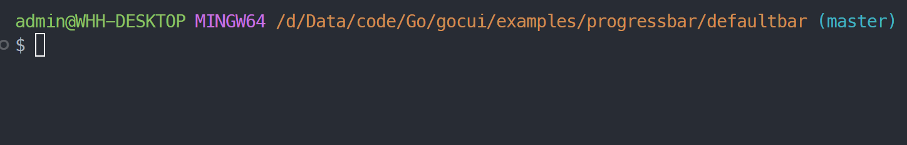
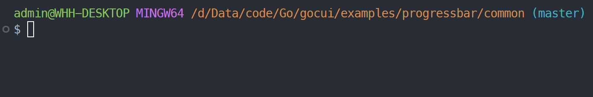
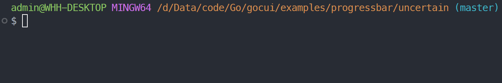

# Gocui

Gocui is a simple command line graphics toolkit for Go.Use it to build simple command line applications easily.

// At present, this is just a simple small project, welcome to help improve it.

# Features
- Easy to use. Just create an object and set its style, then call `Run()` to start the application.
- Customizable style. You can choose from different tokens to customize the style of the objects.
- Compatible. It use CSI codes to control the terminal.

# Functions
- Progress bar: Create a progress bar or an uncertain progress bar. And you can set the style of the progress bar.
- Text box: Create a text box to contain text.
- graph: Draw lines or curves in the terminal.

# Examples

## Progress Bar
bar running by iter.

### Use Default Bar Style
gocui provide a default bar style:
```go
p := pb.DefaultBar
it, _ := p.Iter()
for range it {
	//fmt.Printf("i=%d\n", i)
	time.Sleep(time.Millisecond * 50) // Simulate some time-consuming task
}
```
which looks like:


### Common usage
You can decorate the bar by format string with tokens supported.

```go
// test progress bar
p, _ := pb.NewProgressBar("%spinner[%bar] %percent %rate [%elapsed]",
	pb.WithStyle(pb.Style{
		Complete:        ">",
		Incomplete:      "-",
		CompleteColor:   font.Green,
		IncompleteColor: font.LightBlack,
	}))
it, _ := p.Iter()
for range it {
	time.Sleep(time.Millisecond * 50) // Simulate some time-consuming task
}
```
Which looks like:


### Uncertain progress bar
gocui support uncertain bar, main goroutine can stop it anytime.

```go
//test uncertain progress bar
up, _ := pb.NewProgressBar("[%bar] waiting operation...%spinner", pb.WithUncertain(),
	pb.WithStyle(pb.Style{
		Incomplete: " ",
		UnCertain:  "👈🤣👉",
	}))
stop := up.Run(time.Millisecond * 100)
// Simulate a 3-second time-consuming task
time.Sleep(time.Second * 3)
close(stop)
fmt.Printf("\ndone")
```
which looks like:


## Text box
```go
payload := []string{
		"          Books Management System",
		"",
		" 1.Store new books    2.New user registration",
		" 3.Borrow books       4.Return books",
		" 5.All books          6.All user",
		" 7.Delete database    8.Log out",
		"",
		"          Select operation number:",
	}
window.ClearScreen()
aBox, _ := box.GetBox(len(payload)+2, 50+2, "bold", payload)
box.SetBoxAt(aBox, 0, 0)
```

This will create a text box and set it to the top left corner of the screen.

# Customization

// Currently, only Progress bar is supported.

Use a format string to customize the style of the objects,in which you can use the tokens to customize the style of the objects.

You can think of tokens as verbs in go.

## Tokens

Tokens that users use to customize the style of the objects.

### progress bar
- `%bar`: the progress bar
- `%current`: the current value
- `%total`: the total value
- `%percent`: the percentage
- `%elapsed`: the elapsed time
- `%rate`: Interval between two updates

# TODO
- [ ] Add more examples
- [ ] Add more modules
- [ ] Support more tokens
- [ ] Allow users define their own tokens
- [ ] Expand application scenarios, such as support parameters processing...
